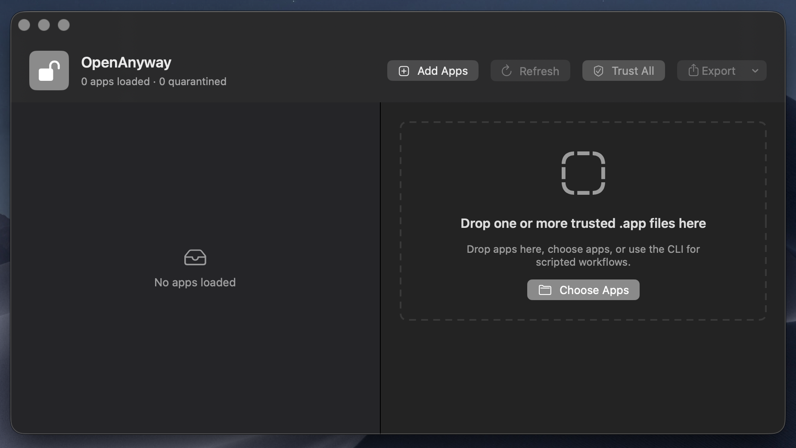

# OpenAnyway

OpenAnyway is a small native macOS utility for removing the quarantine
attribute from trusted `.app` bundles without asking users to type Terminal
commands.



It is intended for indie developers, open-source applications, internal tools,
beta builds, and other trusted software workflows where Gatekeeper quarantine
gets in the way of launching an app you already trust.

## Features

- Drag and drop `.app` bundles
- Batch processing for multiple apps
- Browse for an application with a native file picker
- Inspect quarantine status
- Read app name, bundle ID, version, build, and executable metadata
- Remove `com.apple.quarantine` recursively with `xattr`
- Open the selected application after quarantine removal
- Reveal selected apps in Finder
- Export inspection reports as CSV or JSON
- CLI executable for scripted workflows
- Offline-first SwiftUI interface
- Testable Swift core module
- No analytics, login, background service, or network dependency

## Requirements

- macOS 13 or newer
- Xcode command line tools
- Swift 6 compatible toolchain

## Build

```bash
swift build
```

## Run

```bash
swift run OpenAnyway
```

## CLI

Build and run the command line tool:

```bash
swift run openanyway help
swift run openanyway inspect /Applications/Example.app
swift run openanyway trust /Applications/Example.app
swift run openanyway export-json /Applications/Example.app
swift run openanyway export-csv /Applications/Example.app
```

The CLI accepts multiple `.app` paths for batch workflows.

## Test

```bash
swift test
```

## Example Test App

Create a disposable quarantined app bundle for local testing:

```bash
./Examples/create-quarantined-test-app.sh
```

Then run OpenAnyway and drag `/tmp/OpenAnywayExample.app` into the window.

You can also pass a custom output path:

```bash
./Examples/create-quarantined-test-app.sh /tmp/MyExample.app
```

## How It Works

OpenAnyway validates that the selected item is a real `.app` bundle with a
`Contents/Info.plist`, checks its quarantine status with:

```bash
xattr -p com.apple.quarantine /path/to/App.app
```

and removes quarantine with:

```bash
xattr -dr com.apple.quarantine /path/to/App.app
```

The app does not disable SIP, patch macOS, bypass code-signing validation, or
alter Gatekeeper policy. It only removes the quarantine extended attribute from
an app bundle selected by the user.

## Project Layout

```text
Package.swift
Sources/
  OpenAnyway/
    AppViewModel.swift
    ContentView.swift
    OpenAnywayApp.swift
    Resources/
  OpenAnywayCLI/
    main.swift
  OpenAnywayCore/
    AppInspection.swift
    AppBundleValidator.swift
    AppMetadata.swift
    QuarantineService.swift
    ReportExporter.swift
    TrustedAppWorkflow.swift
Tests/
  OpenAnywayCoreTests/
Examples/
  create-quarantined-test-app.sh
```

## Security Notice

Only remove quarantine from applications you trust and obtained from reputable
sources. OpenAnyway is a convenience tool, not a trust or malware scanner.

## License

MIT
